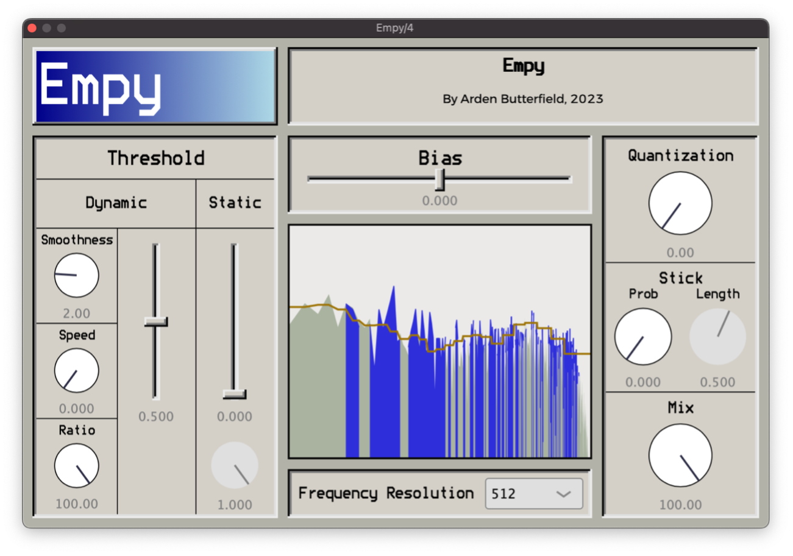

# Empy

- Sculpt the sound of MP3s, spotty phone calls, bitcrushers, and more.
- Inspired by the MP3 encoding process, Empy lets you control every step of its distortion algorithm.
- Discover unique and varied forms of distortion.
- [Free Mac download](https://github.com/ArdenButterfield/Empy/releases/tag/v1.0.0-mac), Windows download in the works.
- Code is open-sourced under the GPL-3.0 license, and avaliabe right here on Github: you can build, hack, and tinker with Empy yourself.

I made Empy as a part of my undergraduate thesis at the University of Oregon.

[See Empy in action](https://youtu.be/RhrXB1W7zAI)!

[Read the manual](User%20Manual.md).

## Build instructions

Building Empy requires the JUCE library. Open `Empy.jucer` in Projucer. If Necessary, update the path to JUCE in Projucer. If building in XCode, click the "Save and Open in IDE" button; otherwise, create a new build target for the build system you are using. In the IDE, run the build scheme.

Now, if you check the user plugin directory (`~/Library/Audio/Plug-Ins` on Mac), you should see both Empy.vst3 and Empy.component. Now, when you launch your DAW, Empy should show up in the list of plug-ins, under the manufacturer name Arden Butterfield.
