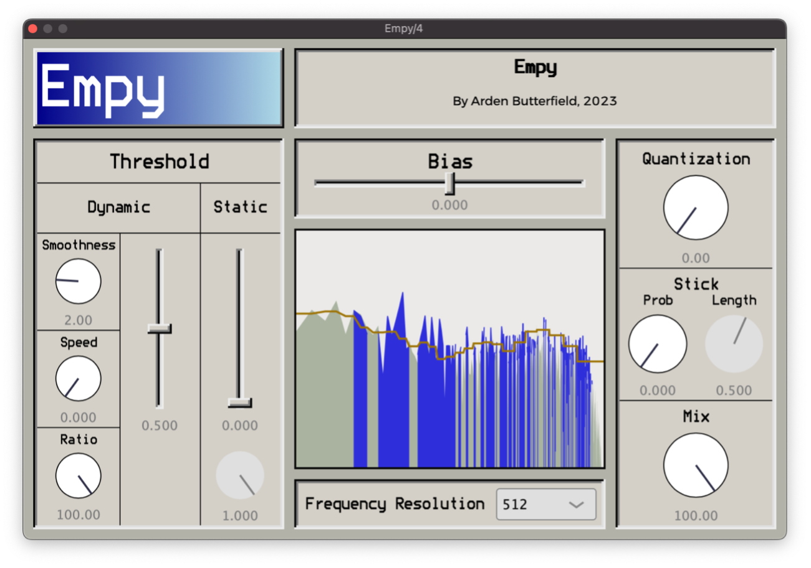

# Empy

- Sculpt the sound of MP3s, spotty phone calls, bitcrushers, and more.
- Inspired by the MP3 encoding process, Empy lets you control every step of its distortion algorithm.
- Discover unique and varied forms of distortion.
- Free downloads for Mac, Windows *and* Linux.
- Code is open-sourced under the GPL-3.0 license, and avaliabe right here on Github: you can build, hack, and tinker with Empy yourself. Just release your changes under the same license.

I made Empy as a part of my undergraduate thesis at the University of Oregon.

[See Empy in action](https://youtu.be/RhrXB1W7zAI)!

[Read the manual](Docs/User%20Manual.md).

Empy's partner plugin [Fish](https://github.com/ArdenButterfield/Empy/) is a simple 1-knob approach to MP3 compression.

## Installation Instructions

Under the [releases](https://github.com/ArdenButterfield/Empy/releases/) tab from this page, download the file corresponding to your operating system. 

On Windows or Mac, follow the instructions in the installer to install the plugin to your plugins folder. 

On Linux, you'll have to copy `Empy.vst3` to your plugin folder. Often this is at `~/.vst3`.

If you have any issues, please raise an issue on the issues page of this repository and describe your situation.