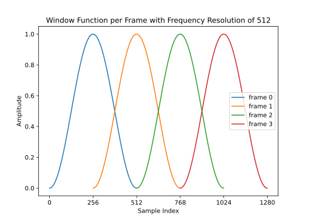
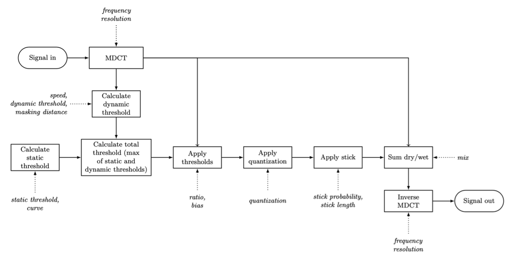
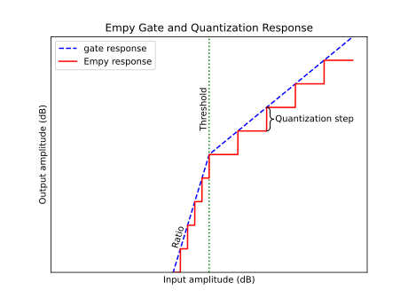

# Empy User Manual

Empy is a plugin for a wide range of lossy distortion sounds, drawing inspiration from lossy audio compression codecs like MP3. Empy can sound bubbly and metallic. It can resemble a bitcrusher. It can freeze sound at spots, like a choppy phone connection. An any setting, Empy gives sound distinctive lossy distortion.

The algorithms within Empy are much simpler than the MP3 codec. The MP3 codec loops through different encoding levels, trying to find one that fits within the bit budget and the allowable distortion. Empy is, at its core, a spectral gate. An ordinary gate works in the time domain: it uses the amplitude of each sample, passed in one at a time, to determine if the audio is loud enough to pass through the gate or not. An ordinary gate has one threshold: audio louder than the threshold passes through unchanged, while audio below the threshold is attenuated, often all the way to zero. Empy, on the other hand, works in the frequency domain.  Each frequency has its own gate, and different gates can have different thresholds. This means that rather than acting only on the amplitude of a sound, Empy can change the timbre of the sound, removing quieter frequencies to give the sound a watery, MP3-like quality, or biasing its gate towards high or low frequencies to filter the sound.

The gates in Empy differ from normal gates in one other important way. In Empy, there are two thresholds that a sound must pass to be allowed through the gate. The first is the static threshold, as you would see in a traditional gate: if the signal at 400 Hz is louder than -20 dB, it passes. The second is the dynamic threshold, which changes over time to follow the amplitude of the frequencies: if the signal at 400 Hz is sufficiently loud, compared to the recent amplitudes in the neighborhood of 400 Hz, it passes the gate. A signal only passes through Empy if it is above both of these gates.

These two gates represent the absolute threshold and masking threshold of the MP3 psychoacoustic model. The static threshold models the removal by the MP3 algorithm of sounds below the absolute threshold of hearing, and the dynamic threshold does the same for the masking threshold. Unlike the MP3 codec, Empy is not an attempt to maximize sound quality while minimizing file size. Empy is a creative tool. Therefore, Empy offers further controls to shape the sound. The static threshold can be raised and lowered, and the user can also transition between a flat curve, where each frequency has the same static threshold, and a perceptual curve, which follows the absolute threshold of hearing. The user can raise and lower the dynamic threshold as well, and can change the distance between frequencies that sounds are able to mask for. 

Empy also offers some controls inspired by traditional time-domain gates. The user can control the rate at which the dynamic threshold moves, which provides rough control of the attack and release of the gate. Additionally, Empy offers a ratio knob, to control how much the signal below the threshold is attenuated. 

Further shaping of the sound can be achieved with the bias, quantization, frequency resolution, and stick controls. Some of these controls are my attempts to reverse engineer the controls offered by other lossy distortion plugins. For instance, Goodhertz’s Lossy has a “packet repeat” mode that I wanted to implement here. Other controls, like frequency resolution and quantization, were inspired by components of the MP3 encoding process itself. My goal was to give the user of Empy as much control as possible in designing their sound, letting the user fine-tune the parameters of packet repeat much more than they can with Lossy.

Processing the signal in the frequency domain causes Empy to have some unavoidable latency. To convert from the time domain to the frequency domain, Empy uses the Modified Discrete Cosine Transform, or MDCT. This algorithm, which similar to the Fast Fourier Transform (FFT), converts a frame of audio samples into their frequencies.  The MDCT uses overlapping windowed frames of audio to avoid harsh discontinuities at the transition points between windows. The MDCT cannot convert a frame to the frequency domain until every sample in that frame has arrived, meaning that Empy’s latency is determined by the MDCT window size. Larger window sizes are useful for encoding because of their greater frequency resolution. The Ogg Vorbis codec, a popular lossy compression algorithm that uses the MDCT, supports window sizes ranging from 64 all the way up to 8192 samples.  At the common sampling rate of 44100 Hz, an 8192 sample window incurs 185.8 milliseconds of latency, rendering it virtually unusable for a real-time audio plugin. AAC Low Delay, a lossy compression algorithm designed for low latency, real-time applications, uses the MDCT transform with 50% overlap as well, with a 512 sample window, resulting in under 20 milliseconds of latency.  Drawing inspiration from AAC Low Delay, I set Empy’s default window size to 512 samples, while allowing the user to change the window size using the frequency resolution drop-down menu.

## The Empy GUI

The three columns of the Empy graphical user interface (GUI) roughly correspond to the signal flow through the plugin. The first column contains controls for building the dynamic and static thresholds. These thresholds then get tilted towards the low or high frequencies by the bias control in the middle column. After the thresholds are applied to the sound, the sound can be further processed by the controls on the right column, in the order they appear from top to bottom.

### Threshold Panel

The left panel of the plugin controls the thresholds and their effects on the signal. To save processing power, the dynamic thresholds are calculated in bands of approximately 1 octave, hence the jagged shape of the spectrogram.

### Smoothness

This knob controls how far the energy in a band will spread to calculate the dynamic threshold. Higher values will result in smoother masking, while lower values tend to bias the low frequencies slightly.

### Speed

The dynamic threshold for a band is based on the root-mean-square of the amplitude, and speed controls the length of that RMS window. A value of 0 only takes the most recent frame into account, while higher values place weight on a longer window. At lower speed values, Empy has a bubblier sound, which gets smoother at higher speed values. High speed values can also give an interesting effect with attack-heavy sounds, where the attack is able to pass through without being distorted by the threshold.

### Ratio

Ratio controls the strength of the gate at attenuating sounds below its threshold. With a ratio of $a$, a sound $x$ decibels below the threshold will be attenuated until it is $a*x$ decibels below the threshold. When the ratio is set to a high number, the gate essentially silences frequencies below the threshold; when the ratio is set to 1, the gate has no effect.

### Dynamic Threshold

This slider controls the level of the dynamic threshold, shifting it up or down by the same amount for all frequencies. At zero, no dynamic threshold is applied, so the speed and masking distance knobs have no effect.

### Static Threshold

This slider controls the level of the static threshold, shifting it up or down by the same amount for all frequencies. At zero, no static threshold is applied, so the curve knob has no effect.

### Curve

This curve knob interpolates between the two static threshold curves. At 0, the static threshold is flat, and at 1 the static threshold follows the absolute threshold of hearing for humans.
 
### Bias
Bias tilts the thresholds calculated in the previous section towards the low or high frequencies. At lower bias settings, more low-frequencies and less high-frequencies will get through the threshold, and vice versa for high settings. At 0, there is no bias towards low or high frequencies. When the static and dynamic threshold knobs are both at zero, bias has no effect.

### Frequency Resolution

Frequency resolution determines the number of frequency lines we use in the transform. Using more lines require a wider input window, which allows Empy to break the spectrum down into more frequencies. Higher frequency resolution results in a smoother sound, but introduces more latency. At very low frequency resolution, Empy functions more like a conventional bitcrusher, and has a harsh, crackling sound.

### Quantization

Quantization works a bit like bit reduction in a bitcrusher, reducing the number of possible values for each amplitude and rounding the amplitudes down to the nearest option. The quantization knob sets the number of decibels between each quantization option, so higher values will change the sound more aggressively. A setting of 0 results in no quantization.

Quantization in Empy works differently from quantization in the MP3 codec. In MP3 encoding, the step between quantization options is determined using a loop, to minimize bit usage while keeping distortion under the threshold. In initial versions of Empy, I tried setting the quantization step to be dependent on the threshold. However, I preferred the sound of a set quantization step for all frequencies. 

### Stick

With stick, the sound can get “stuck” on a frame. This section draws inspiration from packet loss recovery algorithms in telecommunications, where a program might try to cover up a gap by stretching out the current sound. This section of the plugin has a gray “indicator light” that flashes on when the sound is currently stuck.

### Probability

The proportion of time spent stuck. At 0, the sound will never get stuck, at 0.5 it will be stuck about half the time. At 1 it will always be stuck. Note that at probabilities of 1, the sound will still change, as often as is set by the length knob.
### Length

The average length that the sound will stay stuck for. The exact length of each stick is random.
### Mix

The balance between input and processed signal returned by the plugin. 

### Spectrum Graph

The spectrum graph shows what Empy is currently doing to the audio passing through it. The gray spectrum shows the amplitude at each frequency of the dry signal, and the blue spectrum shows the amplitude at each frequency of the wet signal. Lower frequencies are on the left, higher frequencies are on the right. A taller bar corresponds to more amplitude at the corresponding frequency.

The graph also shows a brown line, which is the current total threshold, equal to the maximum of the dynamic and static thresholds. If a peak of the gray spectrum is below the brown line, that means that the corresponding frequency is below the threshold, and its amplitude will be reduced by the amount set with the ratio control.

When the mouse moves over certain controls, an orange line will appear on the spectrum graph as well. This orange line gives some information on what that control is doing to the sound.

- For smoothness, the orange line shows how far the energy in each band gets spread to the neighboring bands.
- For the speed knob and the dynamic threshold slider, the orange line shows the dynamic threshold.
- For the static threshold slider and curve knob, the orange line shows the static threshold.
- For the bias slider, the orange line shows the bias curve that gets multiplied by the threshold to bias it towards the low or high frequencies.

Double-clicking on the spectrum graph toggles it on and off.

### Tooltips
 
As you move your mouse over a control, the window in the top right of the GUI will display a description of what that control does.

